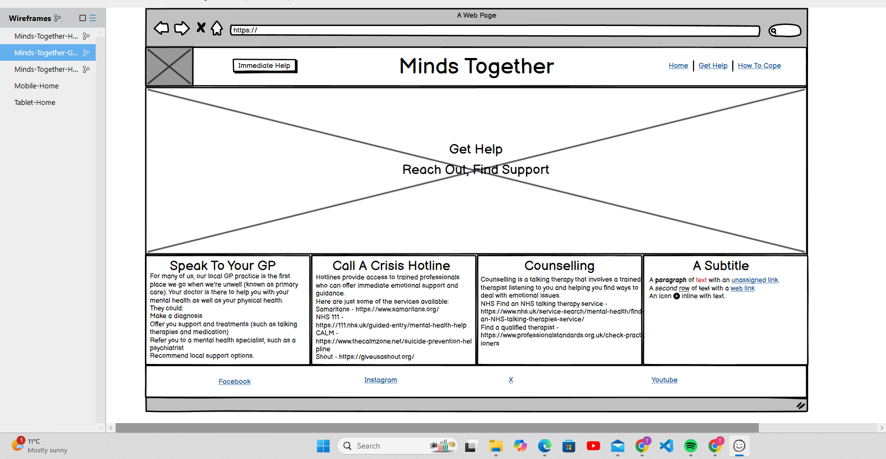

# MINDS TOGETHER

Minds Together is a warm and safe place to go for advise on how to cope easier with mental health. Minds Together has been developed as part of Code Institute's Full-Stack Software Development Bootcamp as my 1st ever project. This project is made by using HTML, CSS and Bootstrap. Mental Health is a subject that is close to my heart so it was a pleasure to cover this topic for my first project.

---

## CONTENTS

* [User Experience](#user-experience-ux)
  * [User Stories](#user-stories)

* [Design](#design)
  * [Colour Scheme](#colour-scheme)
  * [Typography](#typography)
  * [Imagery](#imagery)
  * [Wireframes](#wireframes)

* [Features](#features)
  * [General Features on Each Page](#general-features-on-each-page)
  * [Future Implementations](#future-implementations)
  * [Accessibility](#accessibility)

* [Technologies Used](#technologies-used)
  * [Languages Used](#languages-used)
  * [Frameworks, Libraries & Programs Used](#frameworks-libraries--programs-used)

* [Deployment & Local Development](#deployment--local-development)
  * [Deployment](#deployment)
  * [Local Development](#local-development)
    * [How to Fork](#how-to-fork)
    * [How to Clone](#how-to-clone)

* [Testing](#testing)

* [Credits](#credits)
  * [Code Used](#code-used)
  * [Content](#content)
  * [Media](#media)
  * [Acknowledgments](#acknowledgments)

---

## User Experience (UX)

### User Stories

 External User’s Goal:
 The user seeks accessible, beginner-friendly information on mental health, including
 howtorecognize commonissues and managestress, presented in a supportive and
 organised layout.
 Site Owner’s Goal:
 The site owner wants to create a welcoming webpage that provides basic mental
 health information using a clean and supportive design. The focus is on using HTML and CSS with Bootstrap to create a calming and well-organised user experience.

 #### Client Goals
 * Wants the resources and links to be easily accessible to assist in times of crisis and to help prevent a crisis.
 * Wants to create a safe and calming space to help the users manage their well-being.
 * Wants to provide useful resources for managing mental health.

 #### User Goals
 * Wants to know how to cope in times of need.
 * Wants the information to be easy to access.
 * Wants to find tips and strategies for managing anxiety to improve mental well-being.
 * Links and resources to help in a crisis.
* resources on how to support a loved one suffering wiht mental health.

## Design

### Colour Scheme

I chose this colour palette as I found the colours were calming. I took each colour from my hero image.

### Typography

I chose the font Roboto as I found it to be an informative yet friendly font. It is also an accessibly friendly font. The weights i included are 400,500,600 and 700 for the variety of different sized headers.

I used [Google Fonts](https://fonts.google.com/) to import my fonts.

### Imagery

Use this section to explain what sort of imagery you plan to use through your site.

### Wireframes

I made my wireframes using Balsamiq.

## Features

My site is made up of the Home page, the Get Help page and the How To Cope page.

### General features on each page

General features that reoccur on each page are the navbar, footer, favicon, 

### Future Implementations

### Accessibility

In my project I have added aria-labels and names to all my links and buttons to enable screen readers to understand each element. I have run a lighthouse test and a wave test to ensure I have met the requirements needed to be accessible friendly.

## Technologies Used

### Languages Used

* HTML
* CSS

### Frameworks, Libraries & Programs Used

* Balsamiq - To create the wireframes
* Git - For version control
* Github - To save and store my project
* Bootstrap 4.6 - The framework for my project, this was used for my header, the modal and the cards.
* Google Fonts - For importing the font used in my project
* Font Awesome - For the icons for my social media links and my burger icon for the mobile menu
* Google Dev Tools - To troubleshoot and test features, solve issues with responsiveness and styling.
* Am I Responsive - To gather Images for my README that display on different devices.
* 
Add any frameworks, libraries or programs used while creating your project.

Make sure to include things like git, GitHub, the program used to make your wireframes, any programs used to compress your images, did you use a CSS framework like Bootstrap? If so add it here (add the version used).

A great tip for this section is to include them as you use them, that way you won't forget what you ended up using when you get to the end of your project.

## Deployment & Local Development

👩🏻‍💻 View an example of a completed Deployment & Local Development section [here](https://github.com/kera-cudmore/TheQuizArms#Deployment)

### Deployment

Github Pages was used to deploy the live website. The instructions to achieve this are below:

* Log in (or sign up) to Github.
* Find the repository for this project, Bully-Book-Club.
* Click on the Settings link.
* Click on the Pages link in the left hand side navigation bar.
* In the Source section, choose main from the drop down select branch menu. Select Root from the drop down select folder menu.
* Click Save. Your live Github Pages site is now deployed at the URL shown.

### Local Development

The local development section gives instructions on how someone else could make a copy of your project to play with on their local machine. This section will get more complex in the later projects, and can be a great reference to yourself if you forget how to do this.

#### How to Fork

Place instructions on how to fork your project here.

#### How to Clone

Place instructions on how to clone your project here.

## Testing

  
Use this part of the README to link to your TESTING.md file - you can view the example TESTING.md file [here](milestone1-testing.md)

## Credits

### Code Used

If you have used some code in your project that you didn't write, this is the place to make note of it. Credit the author of the code and if possible a link to where you found the code. You could also add in a brief description of what the code does, or what you are using it for here.

### Content

Content for the website was created by me with some assistance from [ChatGPT](https://openai.com/chatgpt/)

###  Media

The Images from my site were all taken from [pexels](https://www.pexels.com/) except the main hero image which was generated using [Adobe Firefly](https://firefly.adobe.com/inspire/images?ff_channel=adobe_com&ff_campaign=ffly_homepage&ff_source=firefly_seo).

I converted my images to WEBP using [Pixelied](https://pixelied.com/convert/png-converter/png-to-webp)
  
###  Acknowledgments

My family for their patience and understanding whilst I was completing this project.

[Amy Richardson](https://github.com/amylour) For her assistance and helpful resources. She helped me to find my lost navbar toggler and rectify this. She also helped me to get the spacing in my navbar correct and advised me on how to rectify my button elements.

[Laura Hall](https://github.com/laurachri-hall) for helping me to get my navbar in order, choose my hero image and for overall supporting me through this.